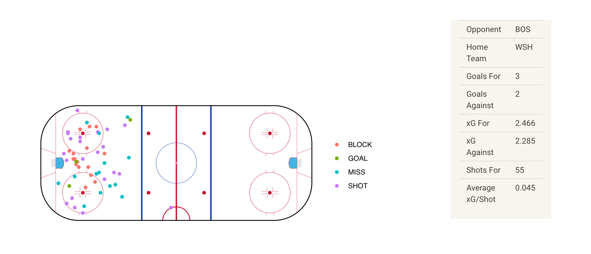
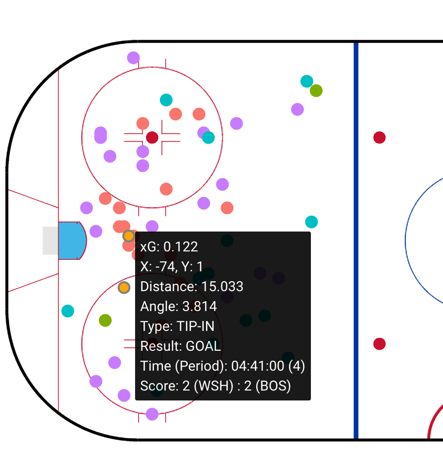
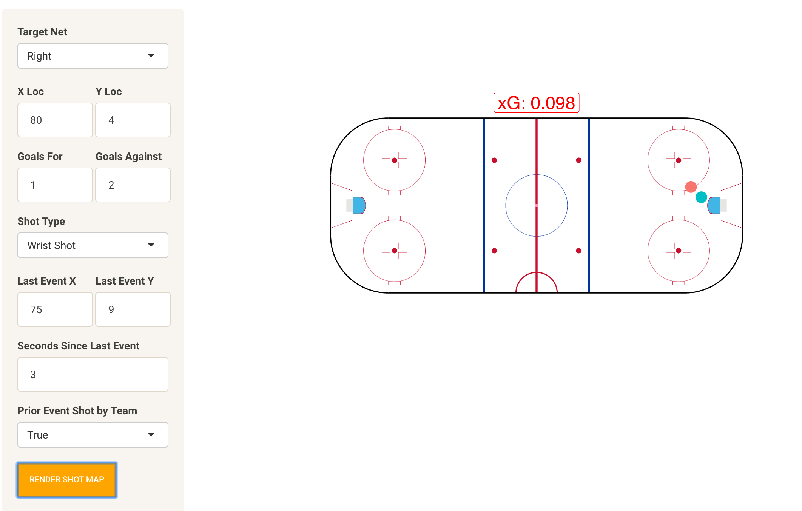

# Link to App
https://mconcan.shinyapps.io/NHL_xG/

# Link to Project Video
https://livejohnshopkins-my.sharepoint.com/personal/mconcan2_jh_edu/_layouts/15/onedrive.aspx?id=%2Fpersonal%2Fmconcan2%5Fjh%5Fedu%2FDocuments%2FCapstone%5FProject%5FVid%2Emp4&parent=%2Fpersonal%2Fmconcan2%5Fjh%5Fedu%2FDocuments

# Background
This tool is based off of the work of numerous others, including:

[Micah Blake McCurdy](https://hockeyviz.com/txt/xg4)
[MoneyPuck.com](http://moneypuck.com/about.htm), and 
[EvolvingWild](https://evolving-hockey.com/blog/a-new-expected-goals-model-for-predicting-goals-in-the-nhl/)
and many more, who have done some really interesting work in hockey statistics and predicting game features.

Expected goals models are a way of determining how likely a shot is to become a goal. Theoretically, summing the xG throughout a game offers a picture of how many goals a team should have scored based on the quality of their shots. xG models are still quite limited by the data available (often, there is no information on shot speed, for example) and randomness, but they can offer a good picture of play quality througout a game. The basis of an xG model is a logistic regression, based on a variety of in-game parameters. In my model, I used the NHL's play by play data for the 2018-2019 season. The data was limited to a single season based on the time of scraping and processing, and it was scraped by [Harry Shomer's scraping package](https://hockey-scraper.readthedocs.io/en/latest/index.html).
I then filtered out the important events - shots, misses, goals, and blocked shots, and processed those events to create the metrics for my model, as shown below. For simplicity, and because it is a contested subject, the effects of individual player talent (i.e. in shooting skill) were omitted.

X Location, Y Location, Distance From Net, Angle From Net, X Coordinate of Last Event, Y Coordinate of Last Event, Distance from Last Event, Time Since Last Event, Last Event was a Shot by the Same Team (T/F), Shot Type, Goal Differential 

From these metrics, I obtained an xG model. In the app, this model is used in two ways:

1. Game Maps
In the Game Maps tab, you can create a shot map for a selected game. There are options to select the team, season, game date, and strength to study, though currently only 5v5 play is modeled. From these parameters, a plot ([based on Bill Tran's version of a hockey rink in ggplot](https://raw.githubusercontent.com/mrbilltran/the-win-column/master/nhl_rink_plot.R))is generated showing the xG value of each shot, as well as information about the parameters used to calculate that value. Additionally, game level data on xG and game result is displayed.

2. Shot Simulator
In the Shot Simulator tab, you can determine the xG value of an arbitrary shot. Using inputs such as location, game state, and prior events, an xG value is calculated and plotted along with the shot location. This allows for visualization of how the model handles different parameters.

# Sample Usage
Game Map for 05/18/21 Washington Capitals vs. Boston Bruins

Shot Simulation

